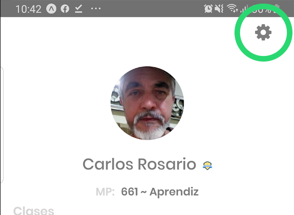

# Cerrar sesión

**Para cerrar sesión debe de seguir los siguientes pasos:**  

**1**.Diríjase a la pantalla de Perfil presionando dicho icono en el tab de navegación.

**2.** Diríjase a la pantalla de configuración presionando el icono de tuerca que aparece en la parte superior derecha de la pantalla.

\*\*\*\*

3. Presione la opción de Cerrar Sesión que aparece en la parte inferior de la pantalla.

Si todo fue completado correctamente la aplicación lo dirigirá a la pantalla de [Inicio de Sesión/Login](iniciar-sesion.md).  

