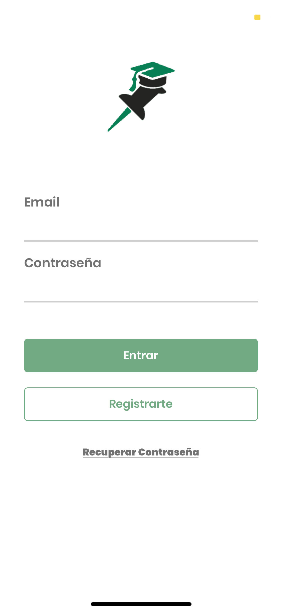

# Iniciar sesión


Para iniciar sesión, debe primero [registrarse en Memo](registro.md).


Al entrar al aplicativo la primera pantalla mostrada es la de inicio de sesión. Proceda a completar sus datos de autenticación \(Email y Contraseña\). Luego presione el botón de “Entrar”.

